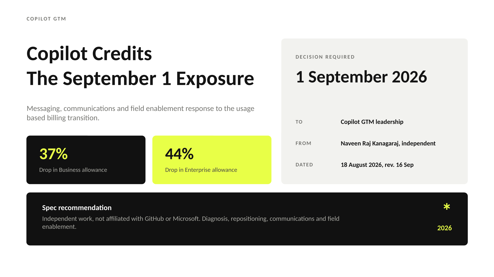
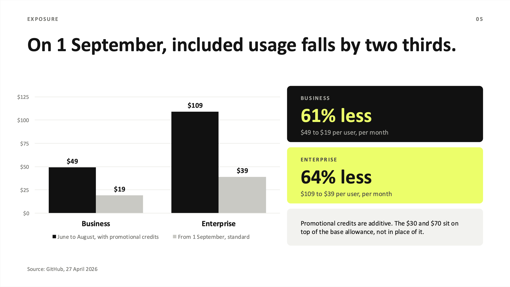
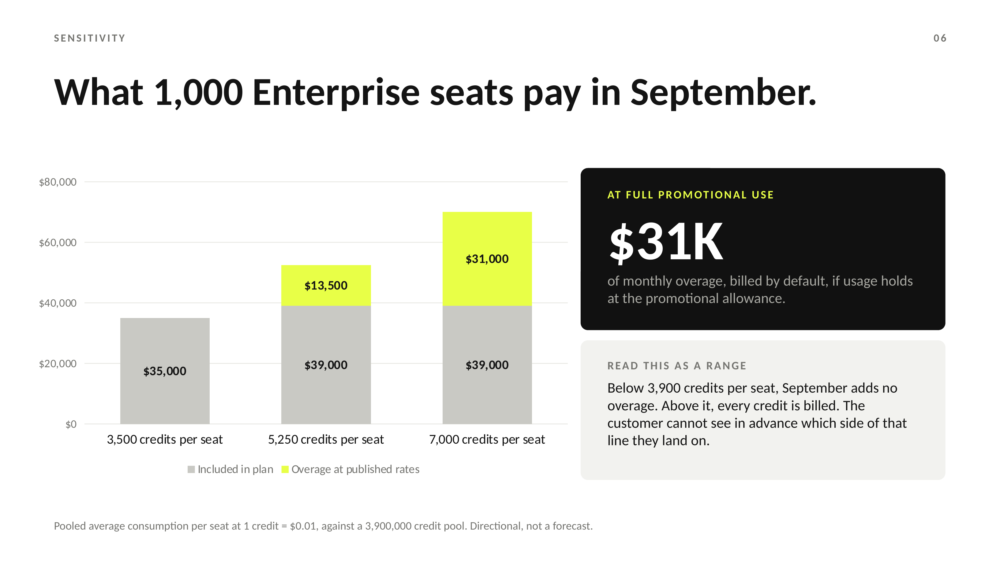
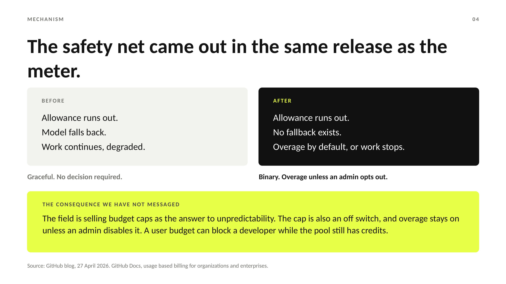
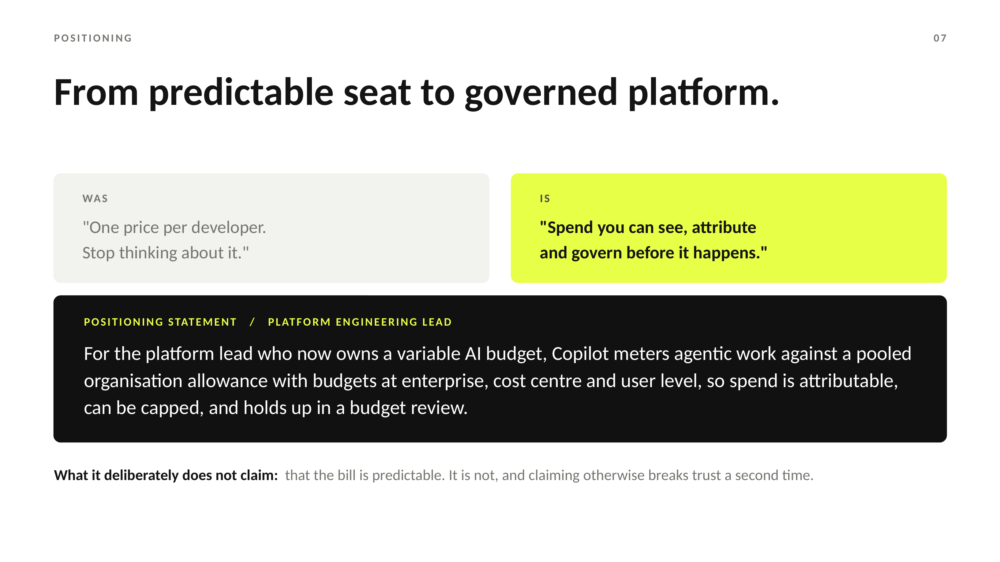

# Copilot Credits: The September 1 Exposure

A product marketing recommendation on GitHub Copilot's move to usage based billing, written as an internal memo dated 18 August 2026, two weeks before promotional credits for existing Business and Enterprise customers expired.

Independent spec work. Not affiliated with GitHub or Microsoft. Figures come from GitHub's announcement of 27 April 2026 and GitHub Docs, and are cited in Appendix A. Assumptions are labelled as assumptions.

**[View the full deck as PDF](Copilot-Credits-September-Exposure.pdf)**

---

## The situation

On 1 June 2026, GitHub replaced Copilot's premium request model with metered AI Credits across every plan, at 1 credit = $0.01. Seat prices did not change: Business stayed at $19 per user per month and Enterprise at $39. Code completions remained unlimited. Chat, CLI, cloud agents and code review became metered.

Existing Business and Enterprise customers received a higher included allowance for the first three months: 3,000 credits per user instead of 1,900, and 7,000 instead of 3,900. That promotion ended on 1 September.

Public reaction was framed as a price rise and came mostly from individual developers. Enterprise exposure was deferred, not avoided.

## The argument

**GitHub did not raise prices. It removed the ability to forecast them.**

That distinction decides what the response should be. A cost increase is absorbed by a budget owner and negotiated at renewal. A forecasting failure is escalated to finance and triggers procurement review. GitHub produced the second and is being criticised for the first, so every proposed fix that adjusts price is solving the wrong problem.

## What the documentation shows

Three details in GitHub's billing documentation turn the argument into an operating problem.

**The cut is concentrated, not universal.** Included usage falls 37% for Business and 44% for Enterprise. A 1,000 seat Enterprise organisation averaging under 3,900 credits per seat pays no overage in September. One at full promotional use pays $31,000 more a month. Most accounts are fine, and none can tell in advance which group they are in.

**The safety net came out with the meter, and overage is the default.** Under premium requests, an exhausted allowance fell back to a cheaper model and work continued. Under credits there is no fallback. Additional usage is enabled by default for organisations, so doing nothing means an uncapped bill. Setting a cap means developers can stop mid task, and a user level budget can block a developer even while the pooled allowance still has credits.

**Cost depends on variables the buyer cannot see at purchase.** Output tokens cost $5 per million on Claude Haiku 4.5 and $25 on Claude Opus. For Copilot code review, the model is chosen automatically and not disclosed.

## The recommendation

Reposition from predictable seat to governed platform. Name the cap trade off before customers find it. Ask Product for a degraded capability floor at the cap so governance does not mean stoppage.

The positioning deliberately does not claim the bill is predictable, because it is not, and claiming otherwise breaks trust a second time.

## Method

Every load bearing figure traces to GitHub's announcement or billing documentation and appears in Appendix A with its source. Where the blog and the docs could be read differently, the docs were treated as authoritative. Derived numbers are marked as derived. Three inputs are stated as unverified rather than estimated: actual September consumption, budget configuration rates, and competitor pricing.

The sensitivity model is a range across three pooled consumption levels, not a point forecast. Accounts that already ran overage during the promotion sit above every scenario.

Slide 14 carries no invented targets and ends with the condition that would prove the recommendation wrong. Appendices B to G are listed as working assets and are not included in this version.

## Two deliberate choices

**No competitor price points.** Pricing in this category moves monthly and a stale figure in a battlecard is worse than none. The competitive argument is structural: agentic coding consumes frontier inference, that cost is real for every vendor, and the only question is who absorbs the variance.

**A stated cost.** Repositioning on governance rather than predictability concedes the easier sell to flat rate competitors for at least two quarters. The deck says so on slide 13 rather than presenting a recommendation with no downside.

## Revision history

**16 September 2026.** Corrected the reading of promotional credits. The first version treated the $30 and $70 as additional to the standard allowance and reported a 61% and 64% cut, with $70,000 of worst case overage. GitHub Docs states them as totals, so the cut is 37% and 44% and the upper scenario is $31,000. Also added default-on overage and user budget behaviour from the docs, replaced an order of magnitude claim with published model rates, removed two competitive claims that could not be verified, and relabelled the appendices. The central argument is unchanged, and the corrected numbers fit it better: an exposure concentrated in some accounts is a forecasting problem, not a price problem.

**18 August 2026.** First version.

## Sources

- GitHub, *GitHub Copilot is moving to usage-based billing*, 27 April 2026. https://github.blog/news-insights/company-news/github-copilot-is-moving-to-usage-based-billing/
- GitHub Docs, *Usage-based billing for organizations and enterprises*. https://docs.github.com/en/copilot/concepts/billing/usage-based-billing-for-organizations-and-enterprises
- GitHub Docs, *Models and pricing for GitHub Copilot*. https://docs.github.com/en/copilot/reference/copilot-billing/models-and-pricing

Documentation accessed 16 September 2026.

---

Written August 2026 by Naveen Raj Kanagaraj, M.S. Marketing Analysis, DePaul University, Chicago.
